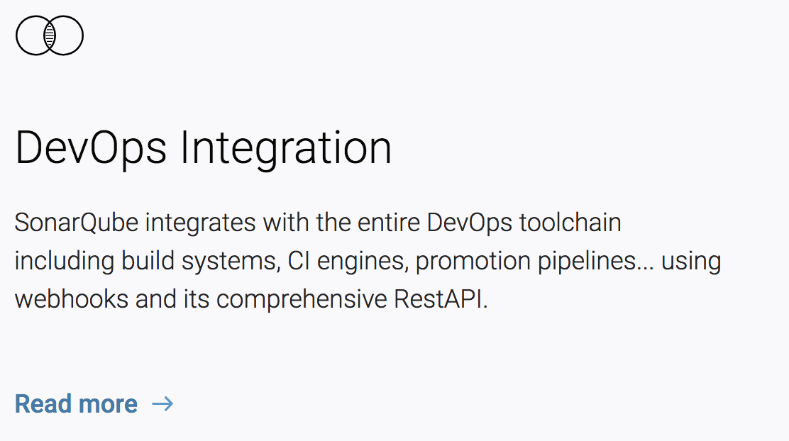

# Hack Days, Improvement & Developer Tooling in AWS
## Chris Walker - Sky Betting & Gaming
### @chriswalkr

^ Hello, I'm Chris Walker, I'm here today to talk about a recent hack day we had at the Sky Bet office in Sheffield, about improvement and about interesting ways to use AWS to solve problems

---

# Quick Introduction

* I'm Chris 👋
* Lead Software Engineer working on Sky Betting & Gaming
* Currently working on the Core Tribe working on Login and Recovery Squad

^ So a quick intro to me, my background is much more on the software development side, and up until a few years ago I was primarly a front end developer. In recent times however I've taken an interest in more of DevOps side of technology.

---

# What's this talk about?

* Hack Days, why they are useful
* What our hack was, how we got it going
* How putting non production, customer facing systems in AWS is a great Introduction to AWS


---
# Hack Days

At Sky Bet we are always looking to try new ideas, one of the ways we do this is "hack days".

Our most recent hack day was around "improvement".

---


^ Made a slack channel for people to put ideas in, everyone invited to put up an idea

---


^ Made a slack channel for people to put ideas in, everyone invited to put up an idea

---


^ Made a slack channel for people to put ideas in, everyone invited to put up an idea

---

# What is Sonarqube?

### SonarQube is a tool for carrying out static code analysis to identify code coverage and bugs in your code.

^ It does this in 3 main ways

---


---


---



---

# Forming meeting

## All the people in Core Tribe came together, if you have an idea you pitch it to the group and convince people to join you

---

# I got a team :thumbsup:


^ My idea must have been ok because I managed to convince 2 people to join me 😂

---

# The day of the hack

* Decided what we wanted to do
* How we'd do it
* We decided we wanted to also learn some new cool stuff about AWS


---

# Why AWS?

^ You might ask why put this in AWS? Isn't this over complicated? Regulated industry, can't easily put stuff we want in AWS. This makes it really nice to be able to do stuff like this in it.

----

# The Idea

* Get SonarQube running in AWS in a Container
* Use RDS for the persistence
* Push some code up there
* :beer: :beer: :beer:

^ Again.. why AWS, regulated industry, learn cool new things

---

# Simple Overview


---

# What we actually got done

* Get SonarQube running in AWS in a Container :thumbsup:
* Use RDS for the persistence :thumbsup:
* Push some code up there :thumbsup:
* :beer: :beer: :beer: :thumbsup:

---

## We came 2nd!
## (and a few more people tagged along)


---

# Where it went from there

* Unfortunately it was all spun up manually :thumbsdown:
* We hadn't automated any part of it :thumbsdown:
* We hadn't properly secured it :thumbsdown:

^ ENI means no static address

---

# Where I took the architecture


---

# What came next

## Automate it using Terraform

---

```json
[
  {
    "name": "myapp",
    "image": "836215041673.dkr.ecr.eu-west-1.amazonaws.com/sonarqube:latest",
    "networkMode": "awsvpc",
    "essential": true,
    "logConfiguration": {
      "logDriver": "awslogs",
      "options": {
        "awslogs-group": "/ecs/myapp",
        "awslogs-region": "${AWS_REGION}",
        "awslogs-stream-prefix": "ecs"
      }
    },
    "environment": [
      {
        "name": "SONARQUBE_JDBC_USERNAME",
        "value": "root"
      },
      {
        "name": "SONARQUBE_JDBC_PASSWORD",
        "value": "rootroot"
      }
    ],
    "portMappings": [
      {
        "containerPort": 22,
        "hostPort": 22
      },
      {
        "containerPort": 9000,
        "hostPort": 9000
      }
    ]
  }
]
```

---

```

data "template_file" "myapp" {
  template = "${file("templates/ecs/myapp.json.tpl")}"
  vars {
    REPOSITORY_URL = "${aws_ecr_repository.myapp.repository_url}"
    AWS_REGION = "${var.AWS_REGION}"
    LOGS_GROUP = "${aws_cloudwatch_log_group.myapp.name}"
  }
}

resource "aws_ecs_task_definition" "myapp" {
  family                = "myapp"
  requires_compatibilities = ["FARGATE"]
  network_mode = "awsvpc"
  cpu = 1024
  memory = 4096
  container_definitions = "${data.template_file.myapp.rendered}"
  execution_role_arn = "${aws_iam_role.ecs_task_assume.arn}"
}

resource "aws_ecs_service" "myapp" {
  name            = "myapp"
  cluster         = "${aws_ecs_cluster.fargate.id}"
  launch_type     = "FARGATE"
  task_definition = "${aws_ecs_task_definition.myapp.arn}"
  desired_count   = 1

  network_configuration = {
    subnets = ["${module.base_vpc.private_subnets[0]}"]
    security_groups = ["${aws_security_group.ecs.id}"]
  }

  load_balancer {
    target_group_arn = "${aws_alb_target_group.myapp.arn}"
    container_name = "myapp"
    container_port = 9000
  }

  depends_on = [
    "aws_alb_listener.myapp"
  ]
}

```

---


```
terraform apply
```

---

# :coffee:

---

```
Apply complete! Resources: 28 added, 0 changed, 0 destroyed.

Outputs:

alb_dns_name = myapp-316097297.eu-west-1.elb.amazonaws.com
myapp-repo = 836215041673.dkr.ecr.eu-west-1.amazonaws.com/myapp

```

---


---

# Summary

* Hack days are great for coming together to do something cool and interesting
* You can use them to try new techniques
* You can provide some real business value
